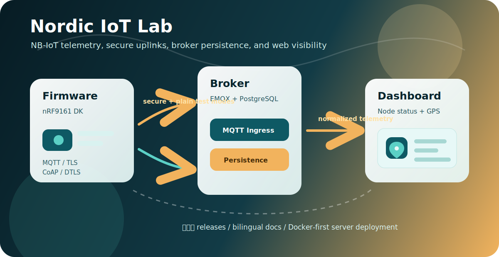

# Nordic IoT Lab



> 中文：Nordic IoT Lab 是一套围绕 nRF9161 / NB-IoT 的端到端实验平台，覆盖固件、MQTT/CoAP 服务器和 Web 可视化面板。
>
> English: Nordic IoT Lab is an end-to-end nRF9161 / NB-IoT experimentation stack covering firmware, MQTT/CoAP server infrastructure, and a web dashboard.

## 项目组成

| 仓库 | 作用 | 当前定位 |
|---|---|---|
| [`nrf9161-status-tag-firmware`](https://github.com/nordic-iot-lab/nrf9161-status-tag-firmware) | nRF9161 DK 固件 | NB-IoT、GNSS、MQTT/CoAP、TLS/DTLS 测试 |
| [`nrf-iot-dashboard`](https://github.com/nordic-iot-lab/nrf-iot-dashboard) | Web 面板 + 轻量后端 | 节点状态、GPS 地图、历史趋势、数据归一化 |
| [`iot-broker-emqx`](https://github.com/nordic-iot-lab/iot-broker-emqx) | EMQX 服务器部署 | MQTT broker、ACL 隔离、PostgreSQL 持久化 |

## Repository Map

| Repository | Purpose | Current focus |
|---|---|---|
| [`nrf9161-status-tag-firmware`](https://github.com/nordic-iot-lab/nrf9161-status-tag-firmware) | nRF9161 DK firmware | NB-IoT, GNSS, MQTT/CoAP, TLS/DTLS testing |
| [`nrf-iot-dashboard`](https://github.com/nordic-iot-lab/nrf-iot-dashboard) | Web dashboard + lightweight backend | Node status, GPS map, history, normalization |
| [`iot-broker-emqx`](https://github.com/nordic-iot-lab/iot-broker-emqx) | EMQX server deployment | MQTT broker, ACL isolation, PostgreSQL persistence |

## Architecture / 架构

```text
nRF9161 firmware
  -> MQTT plain / MQTT TLS / CoAP plain / CoAP DTLS
  -> EMQX + PostgreSQL
  -> nRF IoT Dashboard
  -> node cards, source badges, GPS map, history charts
```

## Versioning / 版本管理

- Firmware official NB-IoT test baseline: `official-nbiot-test-v0.2.0`
- Firmware documentation/organization baseline: `v0.2.1`
- Dashboard baseline: `v0.9.1`
- Broker baseline: `v0.1.1`

The stack is intentionally split into three repositories so firmware, server, and dashboard releases can be tested and rolled back independently.
